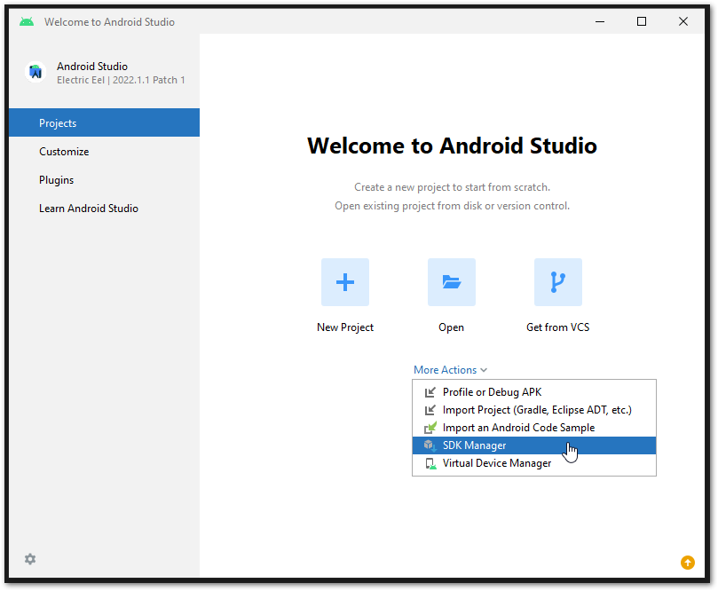
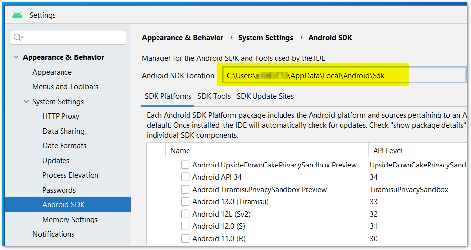
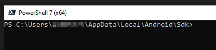
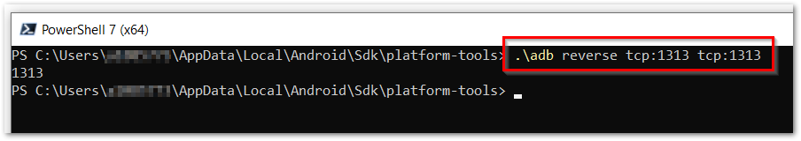
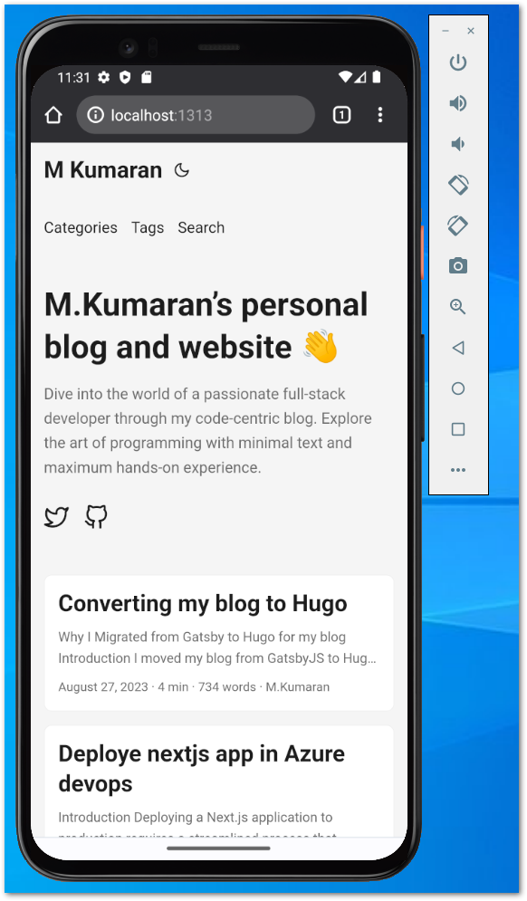

# Two ways to access your local computer's localhost
1. Using IP 10.0.2.2 in emulator
2. Using localhost text in the emulator

## Using IP 10.0.2.2
This is straight forward, open browser in the andriod emulator and go to http://10.0.2.2 it will point to your computer's localhost.

To access your computer's localhost from an Android emulator using "localhost," you can use the special IP address `10.0.2.2`, which is an alias to your host machine's loopback interface (localhost). Here's how to do it:

1. Start your web server or application on your computer, and make sure it's set to listen on the default localhost IP address (127.0.0.1) and the port you want to access.

2. Determine the port on which your web server is running. For example, if your web server is running on port 3000, you'll need to access it at `http://10.0.2.2:3000` from the Android emulator.

3. Open your Android emulator:

   - If you're using Android Studio's built-in emulator, launch it.
   - If you're using a different emulator, open it.

4. In your Android app running inside the emulator, you can access your computer's localhost by using the special IP address `10.0.2.2`. For example, if your server is running on port 3000, you would access it by entering `http://10.0.2.2:3000` in the Android emulator's web browser.

Using `10.0.2.2` is a convenient way to access the localhost of your host machine from the Android emulator without needing to know the actual local IP address of your computer.

## Using localhost from emulator
Sometimes, accessing a computer's localhost is essential, but it becomes even more critical when we require access using the localhost text. This situation often arises when integrating services like Auth0 or other authentication providers. To facilitate the integration, you typically need to specify a URL in the redirect section of the authentication application.

Many authentication providers do not accept an IP address for the redirect URL, and some even demand an HTTPS connection. However, there's an elegant solution—using 'localhost.' This allows us to access our local server solely through the 'localhost' text, without the need for an IP address. This capability ensures a smoother integration process when working with authentication services that have such specific requirements.

### Using adb reverse
The `adb reverse` command in Android Debug Bridge (ADB) is used to set up reverse port forwarding between the Android device/emulator and your computer. This command allows you to route requests from a specific port on your Android device or emulator to a port on your computer. It is often used when you want to access services running on your computer, like a local web server, from your Android device or emulator. Here's how to use it:

#### Find SDK location
Open SDK manager from android studio welcome screen


Go to `Android SDK` and copy the SDK location, like below screen.


#### Run `adb reverse`

1. Open a command prompt or terminal on your computer.

2. Go to the SDK location.



3. Use the `adb reverse` command with the following syntax:

   ```bash
   adb reverse <device port> <host port>
   ```

   - `<device port>`: The port on your Android device or emulator that you want to forward traffic from.
   - `<host port>`: The port on your computer that you want to forward traffic to.

For example, if you have a web server running on port 3000 on your computer and you want to access it from your Android device or emulator, you can use the following command to set up reverse port forwarding:

```bash
adb reverse tcp:3000 tcp:3000
```


This command forwards requests from port 1313 on your Android device or emulator to port 1313 on your computer.

4. Once the `adb reverse` command is executed, the port forwarding is established, and you can access the service on your computer from your Android device using the device's own IP address and port. In this case, you would access your web server on the Android device using `http://localhost:1313`.



## Conclusion

Remember that the `adb reverse` command is a useful tool for local development and debugging, but it's only applicable when your Android device or emulator is connected to your computer. If you need to access the service from a remote device or over the internet, you'll need to configure your network settings accordingly and consider security implications.