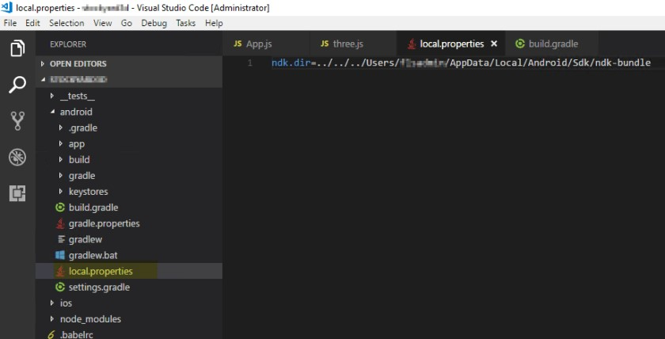
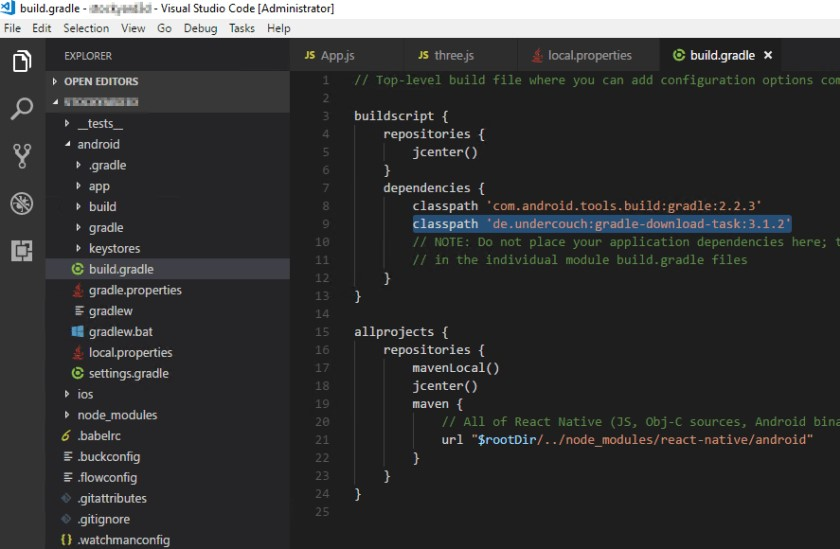
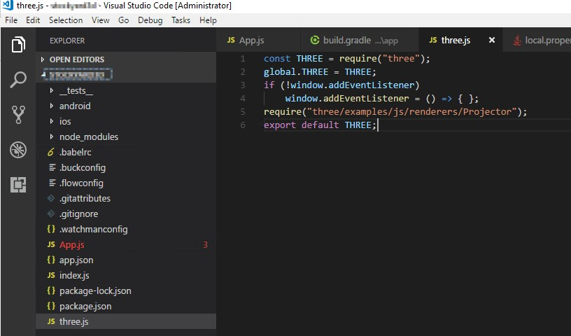

I will show you how to create 3D models in React native using Three.js

Please create a react native project using [react-native init](https://facebook.github.io/react-native/docs/getting-started.html). Make sure that you have Android virtual machine running and everything installed for the basic react native project.

### Install NDK and tools

react-native-webgl is using some C++ code so we need to install the [NDK tools for android](https://developer.android.com/ndk/guides/index.html#download-ndk)

In Android studio –> Tools –> Android –> SDK Manager

select CMake, LLDB and NDK –> Apply –> OK

### Install WebGL and configure

```
npm i --save react-native-webgl
react-native link react-native-webgl
```

create ‘local.properties’ file under android folder add the below

```
linendk.dir=../../../Users/*****/AppData/Local/Android/Sdk/ndk-bundle
```



open android/build.gradle and add the below highlighted line

```
classpath 'de.undercouch:gradle-download-task:3.1.2'
```


in android/app/build.gradle file: Make sure you have minSdkVersion 17 or higher

Try the [sample WebGL code](https://github.com/react-community/react-native-webgl#usage) to make sure that everything is running

### Using Three.js

```
npm install three --save
```

create three.js file and the below file content


```JavaScript
const THREE = require("three");
global.THREE = THREE;
if (!window.addEventListener)
    window.addEventListener = () => { };
require("three/examples/js/renderers/Projector");
export default THREE;
```

Add below content in App.js file

```JavaScript
import React, { Component } from "react";
import { Platform, StyleSheet, Text, View } from "react-native";
import { WebGLView } from "react-native-webgl";
import THREE from "./three";

type Props = {};
export default class App extends Component<Props> {
  onContextCreate = (gl: WebGLRenderingContext) => {
    const rngl = gl.getExtension("RN");

    const { drawingBufferWidth: width, drawingBufferHeight: height } = gl;
    const renderer = new THREE.WebGLRenderer({
      canvas: {
        width,
        height,
        style: {},
        addEventListener: () => {},
        removeEventListener: () => {},
        clientHeight: height
      },
      context: gl
    });
    renderer.setSize(width, height);
    renderer.setClearColor(0xffffff, 1);

    let camera, scene;
    let cube;

    function init() {
      camera = new THREE.PerspectiveCamera(75, width / height, 1, 1100);
      camera.position.y = 150;
      camera.position.z = 500;
      scene = new THREE.Scene();

      let geometry = new THREE.BoxGeometry(200, 200, 200);
      for (let i = 0; i < geometry.faces.length; i += 2) {
          let hex = Math.random() * 0xffffff;
          geometry.faces[i].color.setHex(hex);
          geometry.faces[i + 1].color.setHex(hex);
        }
        let material = new THREE.MeshBasicMaterial({ vertexColors: THREE.FaceColors, overdraw: 0.5 });
        cube = new THREE.Mesh(geometry, material);
        cube.position.y = 150;
        scene.add(cube);
    }

    const animate = () => {
      this.requestId = requestAnimationFrame(animate);
      renderer.render(scene, camera);

      cube.rotation.y += 0.05;
      cube.rotation.x += 0.02;
      cube.rotation.z += 0.03;

      gl.flush();
      rngl.endFrame();
    };

    init();
    animate();
  };

  render() {
    return (
      <View style={styles.container}>
        <WebGLView style={{ width: 400, height: 500 }} onContextCreate={this.onContextCreate} />
      </View>
    );
  }
}

const styles = StyleSheet.create({
  container: {
    flex: 1,
    justifyContent: "center",
    alignItems: "center",
    backgroundColor: "#F5FCFF"
  },
});
```

Below is the running screen

